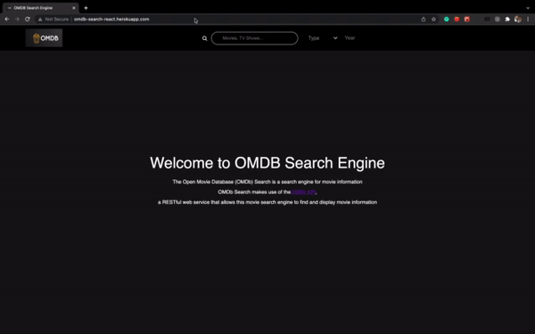

# OMDB API Front End

[Front End Website](http://omdb-search-react.herokuapp.com/)

This application consumes OMDP API WRAPPER(Backend)  Deployed on Heroku:  


```
Front End URL: http://omdb-search-react.herokuapp.com/
```
```
Server URL: https://radiant-taiga-77307.herokuapp.com/
```
## DEMO



##

## Installation

```bash
npm install
```
## Test

```bash
npm test
```
## Run Application

```bash
npm start
```
